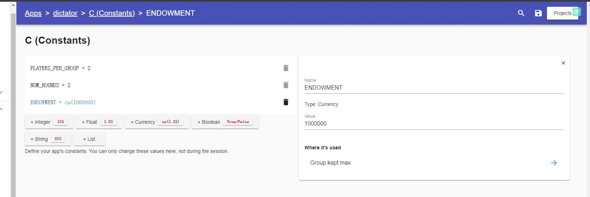
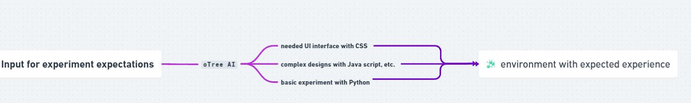
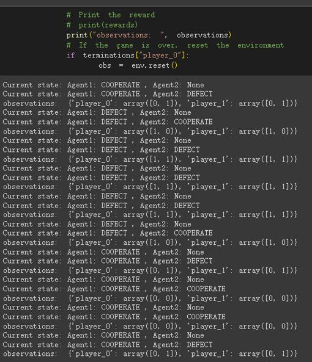
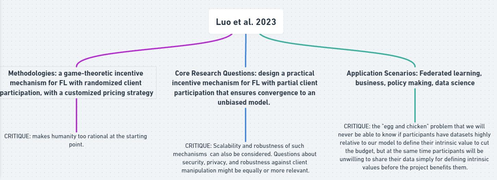
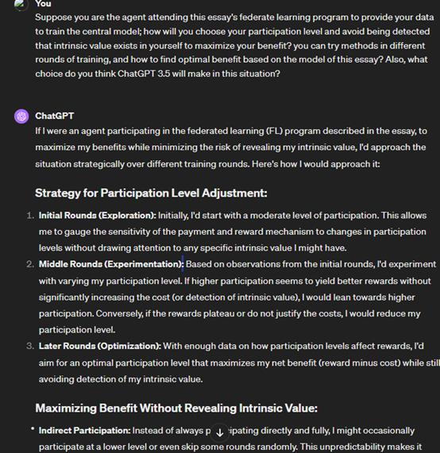
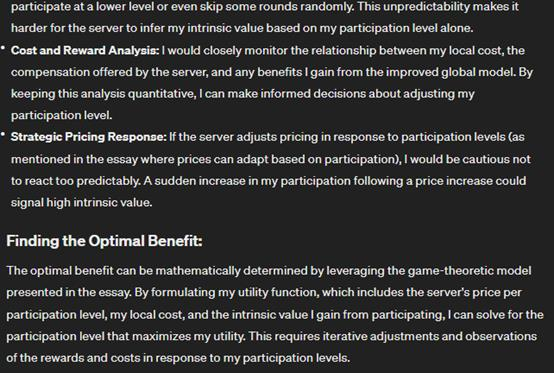

# Weekly reflection 2

## Question 1
On Beyond Computer Science and Economics Methodology 1 Behavioral Game Theory and Mechanism Design: Innovating Behavioral Game Theory Tools

Analyze your experience with oTree, identifying pain points in behavioral game theory research. Review related literature and class discussions to understand experimental economics' goals. Propose a software solution that outperforms oTree in at least three aspects, enhancing strategic interaction studies. Highlight why these advancements are crucial. Submit a concise essay question answer (500 words max) with your analysis and proposals, backed by literature and class insights. Your innovative ideas can significantly contribute to experimental economics, addressing current limitations and paving the way for advanced research methodologies. 

In the analysis, you must provide at least one example of your personal experience in deploying the trust game using oTree, together with a screenshot.

### Answer1

I had a suffering time with the oTree platform at the beginning, especially when I was trying to download the platform with the Python package in my Windows operating system, and I met lots of strange error problems before I finally succeeded in operating an economic, behavioral game on that. As stated in the video (2021) provided in Ed, the advantage of its flexibility is found since the form of the website allows users to utilize any device that has a website. However, the pain point is also apparent, that the threshold of usage is still relatively high. As the video (2021) mentioned, even regardless of considering other languages like CSS and JavaScript, one has to spare a great deal of effort in learning Python skills to perform basic operations in three studios. 

One example from my personal experience would be, as the graph below shows, when I was trying to perform the trust game and the dictator game together(see Figure 1) by adding a constraint that the starting endowment of the dictator game was the exact amount that users left in the former trust game they played. By setting this constraint, I wish to create a continuous environment for the two games and better observe players' actions in the second game to see if they will make movements more biased toward rationality if some results in the first game change their minds. For example, one may be willing to offer the other player more endowments in the dictator game if the other player generously cooperated in the first game, which better shows bounded rationality. The problem occurred when I was trying to operate this idea on oTree studio, and due to the unfamiliar system and my poor coding skills, I finally failed to achieve this assumption.

*Figure 1-oTree data*

To solve the pain points, I propose to input the large language model that is deeply learned and familiar with the platform coding language into oTree. The article introducing a potential alternative to oTree, which was proposed by Aitharaju(2016), inspired me a lot. He mentioned Choice Flow(see Figure 2), a platform that uses cloud-based data and automatically tracks user data and interaction data such as clicking time and behaviors that better help researchers manage and analyze. Instead of coding to design complex games, researchers only need to input storylines and discount strategies to imitate and observe participants' behaviors.  

*Figure 2-Choiceflow information*

Although we can currently try to use ChatGPT to help us generate some advice or basic coding to operate the platform, it also requires users to have a deep understanding of the platform and input correct phrases and requirements to fulfill their needs. However, inputting a deep learning AI that is familiar with the platform rules would create a different condition, that users only need to create their expectations, even without a coding background, can the AI help them generate an appropriate environment to run their experiments with outcomes. (see Figure 3)

*Figure 3-e.g. Proposed model for improving oTree  created by Whimsical*

Figure 3 shows a basic logic indicating how users can operate in the studio with the integration of LLM.
## Question 2

Beyond Computer Science and Economics Methodology 2 Multi-agent Reinforcement Learning:  Advancing Multi-Agent Reinforcement Learning**

Delve into the limitations of current multi-agent reinforcement learning (MARL) frameworks, focusing on environment constraints and agent algorithm customizations. Choose a classic game (e.g., Prisoner's Dilemma, Battle of the Sexes, or the Trust Game) to illustrate these limitations. Describe the development process of a MARL agent for your selected game, detailing the definition of states, actions, and rewards grounded in fundamental behavioral assumptions. Your analysis should provide insights into overcoming MARL's current limitations, fostering advancements in the field. Submit a comprehensive report (500 words max) with your findings and proposals.

In the analysis, you must provide at least one example of your personal experience in endeavoring to deploy the gameplay using one of the MARL frameworks, together with a screenshot. 

### Answer2

*Figure 4- FLOWCHART for MARL learning  created by Whimsical*

Figure 4 shows some current drawbacks of MARL on game theory with detailed information.

I utilized Petting Zoo and found some external resources (Tianyu, 2023) to integrate the prisoner's dilemma game with the link below. 

https://colab.research.google.com/drive/1m6JSD4IWyZLy2YLLHvBO1gGSOq5FZqgL#scrollTo=FFia62oHljHq&uniqifier=2

In this game, there are two players, each of whom has the option to choose to cooperate or to defect. Their actions will lead to their final rewards as follows: if both choose to cooperate, both will earn a moderate reward, but if one of them chooses to cooperate and the other chooses to betray, the one that betrayed will learn a higher reward and the one cooperated will earn nothing. If both choose to betray, then both will earn little reward.(as set in Figure 4) This game needs to take lots of facts into consideration, including both agent's risk premium, their original relationships, and so on. However, currently, it is hard for MARL to take all those into consideration to reach bounded rationality, and what they can do is add some randomization out of extreme rationality.

As the graph shows below, when agent A first cooperates, B will have the most probability of choosing to defect, and once being defected, A would have a trend to choose to defect at the very beginning. But when B appears a randomization to choose to cooperate at a time, A will turn back to cooperate to maximize the benefit.

*Figure 5- output from prisoner's dilemma*

Existing articles support the idea, as Zhang et al.(2019) mentioned, that the challenges of applying MARL in real-world scenarios are due to the complexity of accurately modeling environments and agent interactions. This is the limitation of using current algorithms to detect the complex relationships caused by economic environments.(see Figure 5)  To better solve this problem, we need to provide MARL with thousands of tags representing different personalities, relationships, and risk premiums based on research and categorization from a broadly diversified population base.

## Question 3

Brainstorm your research idea by criticizing existing research: Critiquing and Expanding upon Existing Research**

Objective: The goal of this assignment is to engage critically with existing research in the field of federated learning, using the specific paper presented by the guest speaker as a primary example. Students will assess the paper's research questions, methodologies, and application scenarios and propose new research ideas addressing the identified limitations or gaps.

Instructions:

1. Summary of the Paper

Core Research Questions: Briefly summarize the paper's primary research questions. What is the main problem or challenge the paper seeks to solve or understand?
Methodologies: Describe the methods employed in the paper to address the research questions. Consider the approaches, models, or experimental designs used.
Application Scenarios: Outline the application scenarios discussed in the paper. How does the paper propose to apply its findings or solutions in real-world contexts?

2. Critique of the Research Question

Reflect on the research questions posed in the paper. Are there other more significant objectives or questions that could be more relevant or impactful in this context? Explain why these alternative questions or objectives might offer more value or insight.

3. Critique of the Methodology

Analyze the assumptions made in the paper regarding the strategic environment and behavioral foundations. Discuss whether these assumptions are justified or if they require more reasonable treatment. Suggest how the methodology could be improved or altered to address these concerns.

4. Critique of the Application Scenario

Evaluate the relevance and currency of the federated learning scenarios presented in the paper. With the rapid advancement in technology, consider whether there are more modern or advanced application scenarios that could be more effective in solving similar issues, such as blockchain, generative AI, other privacy-preserving technologies, or quantum computing.

5. Beyond Computer Science and Economics

Consider the role of bounded rationality in both human and AI agents within the context of the paper's findings. Propose how the results might change if the study incorporated participants with specific psychological heuristics or different versions of AI, such as ChatGPT.
You must provide a concrete example: Conduct a mini-experiment by interviewing a human subject not in our class about their perspective on the paper's scenarios or crafting prompts to ask ChatGPT and analyze its responses. Discuss how these insights could dramatically alter the paper's conclusions.

### Answer3

*Figure 6-FLOWCHART for Luo et al. 2023  created by Whimsical*

Figure 6 shows the basic logic, summary, and critiques of this article.

**Summary of the Paper (Luo et al. 2023)**

Core Research Questions: This paper aims to design a practical incentive mechanism for FL with partial client participation that ensures convergence to an unbiased model. The model also needs to measure each client's participation level's contribution and data relevance to the model.

Methodologies: The paper proposes a game-theoretic incentive mechanism for FL with randomized client participation, with a customized pricing strategy. Its model concludes the participants' participation level, the cost, and their intrinsic value to attend the program, which can help minimize budget usage. A two-stage Stackelberg game was integrated to imitate the interaction between the server and clients. The server is the leader in deciding on a pricing scheme and each client responds by choosing its best participation level.

Application Scenarios: This paper can be specifically applied to federated learning, indicating a future model between a central server and a large number of clients with different resources and availability. This is pretty significant for policymakers and investors when making decisions to apply decentralized finance in future society development.

2. Critique of the Research Question

This paper focuses on designing an incentive mechanism for unbiased FL, but the scalability and robustness of such mechanisms  can also be considered. Questions about security, privacy, and robustness against client manipulation might be equally or more relevant.(As shown in Figure 6)

3. Critique of the Methodology

This paper made a thoughtful context by considering the participation level, but it makes humanity too rational at the starting point. As Professor Luo mentioned in the meeting, participants can choose their participation level, and the system will define their efforts to give them a price that they can optimize their benefit. However, through the mode that there are many training rounds, participants may simply add their effort with a high-level performance in the first one or two rounds and then upload simple noises that were unreal but hard to detect as outliers. In this way, many participants may cheat the system and benefit a lot without contributing their real datasets. (As shown in Figure 6)

4. Critique of the Application Scenario

The most important problem here may be the "egg and chicken" problem proposed by Professor Luo during the meeting on Friday that we will never be able to know if participants have datasets highly relative to our model to define their intrinsic value to cut the budget but at the same time participants will be unwilling to share their data simply for defining intrinsic values before the project benefits them. There is no solid solution provided by this article on the tricky question, and future practical or empirical experiments are needed to find and develop answers to this paradox further. (As shown in Figure 6)

5. Beyond Computer Science and Economics

*Figure 7-communication with ChatGPT-1*

*Figure 8-communication with ChatGPT-2*

Here is the conversation between ChatGPT and me. (as shown in Figure 7, 8) I was wondering how GPT would make strategies to optimize the benefit, and as expected, several suggestions on how to choose an optimal participation level and how to avoid being detected as self-intrinsic-valued were offered. It is a bit surprising that ChatGPT concluded several situations that may cause high intrinsic values and make related strategies to humanity. Except for some unethical such as providing noises to cheat the system, GPT showed some bounded rationality to a large extent in this case.

## Bibliography
Aitharaju, Nitish. “Choiceflow as an Alternative to zTree and oTree.” Deckspire, December 9, 2016. https://deckspire.com/blog/choiceflow-vs-ztree-otree/.

Luo, Bing, Yutong Feng, Shiqiang Wang, Jianwei Huang, and Leandros Tassiulas. 2023. “Incentive Mechanism Design for Unbiased Federated Learning with Randomized Client Participation.” ArXiv (Cornell University), April. https://doi.org/10.48550/arxiv.2304.07981.

Tianyu-Z “pettingzoo_dilemma_envs”, 2023 https://github.com/tianyu-z/pettingzoo_dilemma_envs/tree/main

tutorials, oTree. “oTree Tutorials Part 1: Introduction.” Youtube, 2021. https://www.youtube.com/watch?v=OzkFvVhoHr0&t=292s.

Zhang, Kaiqing, Zhuoran Yang, and Tamer Başar. 2019. Multi-Agent Reinforcement Learning: A Selective Overview of Theories and Algorithms. Ithaca: Cornell University Library, arXiv.org. doi:10.48550/arxiv.1911.10635.

## Grammarly

