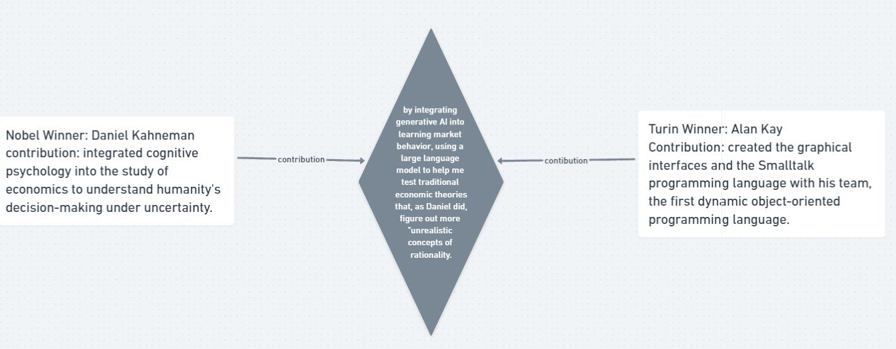
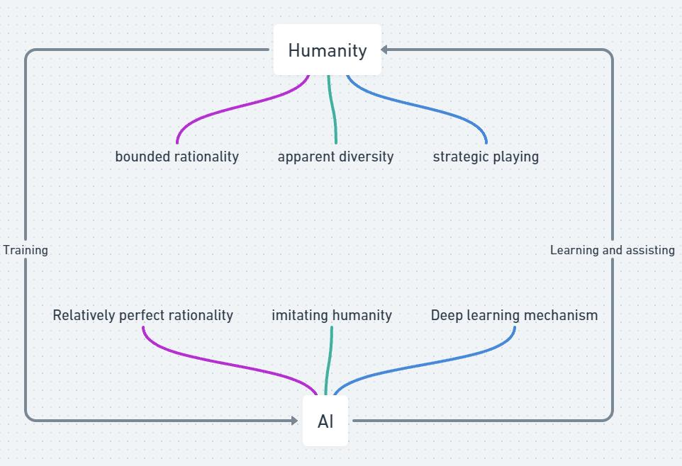

# Weekly reflection 1

## Question 1

**When computer science meets economics**: Who do you truly want to become? Pick one of your favorite Nobel Prize winners (https://www.nobelprize.org/) and Turing Award winners (https://amturing.acm.org/). How do you want to contribute to the intersection of the two north stars to advance human civilizations? 

**Answer 1**

*Figure1: Nobel-Turin interaction for a better future*

This figure illustrates the basic idea from the Nobel and Turin prize winners, and how they interact to contribute to a brighter future.

My favorite Nobel Prize winner is Daniel Kahneman, who integrated cognitive psychology into the study of economics to understand humanity's decision-making under uncertainty. (Frängsmyr, 2019) Though applying psychology to economics may sound regular and should be taken for granted nowadays, the very first concept of behavioral economics was innovative, without a doubt. Just as the interdisciplinary approach between CS and economy that we are now putting effort into, setting up a cross-section approach needs a strong sense of how traditional theories could be biased in reality and a firm root to doubt what has already been taken for granted at the time. As Kahneman himself said, he "has few memories of having changed my mind under adversarial pressure" (Frängsmyr, 2019), but finally proved himself right against the "unrealistic conception of rationality." (Frängsmyr, 2019) Alan Kay, the 2003 Turin Prize winner, created the graphical interfaces and the Smalltalk programming language with his team, the first dynamic object-oriented programming language. (Barnes 2019) His cross-century idea shocked me a lot. How could a small computing system be generated in mind in 1970, when there was no concept of a notebook computer? Somehow, like Kahneman, they both had super innovative minds and a sense of putting effort into stuff that few people cared about at that time. 
    
I want to contribute by integrating generative AI into learning market behavior, using a large language model to help me test traditional economic theories that, as Daniel did, figure out more "unrealistic concepts of rationality. (Frängsmyr, 2019) We live in a complex world, and that huge information gap always leads different types of people to act differently. For instance, research conducted by Susan et al. (2022) found the pervasive nature of information asymmetry across various domains, not just in investments. They suggest that this information gap would cause people's lack of trust, market uncertainty, and diversified risk premium, which may cause irrationality in investments, businesses, and other aspects of society. The situation is spread out, and it's hard to analyze such complex and large data without the computer; generative AI may be a way out due to its deep and self-learning characteristics. By updating and improving the original economic theories, the newly generated theory would better fit the fast-developing and technological society.

## Question 2

**CS&Econ for a Better Future**: How do you perceive the synergy between computer science and economics as a catalyst for steering innovation toward a brighter future? Please present a foundational assertion, followed by multiple specific instances that support your claim, including a reference to a topic discussed at the colloquium on Friday, March 22.

**Answer 2**

*Figure2: CS-ECON interaction*

This figure shows some basic and significant elements of economics and CS, and how they may cooperate.

The synergy of computer science and economics to create innovation for the rising future seems to be an inevitable thing to happen. For a long time, economics has been a significant part of the world since it spares out and deeply researches how society works from humanity's basic needs, production, and consumption. (see Figure 2) Starting from the very beginning of society with simple goods exchange, it is not hard to realize that our current world is simply unifying the common good that citizens use to exchange for their necessities and further pursue goods and services by setting rules that generate necessary productions and consumptions to make us, the dominating species in the world, to coexist and keep this procedure forever. Computer science has been proven to be one of the most effective tools for generating work, and leading technologies such as generative AI have been deeply rooted in society, whether for academics, businesses, or other areas. (see Figure 2) This interdisciplinary approach should be important and will be a leading approach shortly. As the meeting on 22 March mentioned, Satya, introduced as the most innovative CEO in the world, appealed to industries and enterprises to generate design breakthroughs and market breakthroughs to better create surplus for partners and customers with the skillsets of machine learning and computer vision. He thinks that CS tools are inevitable and significant methods to find solutions for enterprises in both macro and micro-economies. This strongly shows that the interdisciplinary approach has a strong reason to exist and will be popular for a long time as long as society keeps developing CS technology. 

## Question 3

**Beyond CS & Econ**: How are aspects of human nature, like bounded rationality, and pioneering technologies, such as generative AI, reshaping the dynamics between humans and AI agents in strategic contexts? Additionally, how might this interplay be perceived and conceptualized distinctively from current models? Address this inquiry by drawing upon the literature covered in our lectures and supplementary scholarly works, ensuring to include in-text citations and a comprehensive bibliography.

**Answer 3**

*Figure3: Human-AI interaction*

This figure shows basic and significant elements of humanity and AI in the area of decision-making, and what the equilibrium of humans and AI may be like.

The dynamics between humans and AI agents have somehow been changed by human nature and current pioneering technology. In some way, AI may fit with the written theories better than humanity. Chen et al. (2023) conducted research by integrating ChatGPT into economic rationality and found that GPT showed a higher rationality score than humanity but is very sensitive to contexts and given choices. This is a great challenge to traditional economic theories since the diversity and complexity of humans always show exceptions for rationality, while AI tools can deeply learn and generate more rationality theories for computers to operate. This is somehow differentiated from the original purpose of those economic theories. The LLM (large language model) may be a way to both distinguish and conceptualize this interplay. Horton(2023) tried to preserve LLM as simulated economic agents by giving it endowments, information, and preferences. The rationality showed by simulated agents under some conditions is even more "human-like" than humanity. (see Figure 3) This is a direct way that we can sense the relationship between AI technology and bounded rationality, and to conceptualize this, one may suggest that the AI model is a bright tool to understand and better present human nature, like bounded rationality, through traditional economic theories and the help of intellectual humanity. As Figure 3 mentioned, the trainer and assistant relationship may be the ideal one for the future.
## Bibliography

Barnes, Susan B. 2019. “Alan Kay - A.M. Turing Award Laureate.” Amturing.acm.org. 2019. https://amturing.acm.org/award_winners/kay_3972189.cfm.

Chen, Yiting, Tracy Xiao Liu, You Shan, and Songfa Zhong. 2023. "The Emergence of Economic Rationality of GPT." Proceedings of the National Academy of Sciences - PNAS 120 (51): e2316205120-e2316205120.

Frängsmyr, Tore. 2019. “The Sveriges Riksbank Prize in Economic Sciences in Memory of Alfred Nobel 2002.” NobelPrize.org. 2019. https://www.nobelprize.org/prizes/economic-sciences/2002/kahneman/biographical/.

Horton, John J. 2023. Large Language Models as Simulated Economic Agents: What can we learn from Homo Silicus?. Ithaca: Cornell University Library, arXiv.org. doi:10.48550/arxiv.2301.07543.

Susan, Enyang Besong and Manases Mbengwor Natu. 2022. "A Critical Review of Information Asymmetry in the Business Cycle: How Digital Ledger Technology can Transform and Sustain the Business Cycle." PLOS Sustainability and Transformation 1 (7): e0000024.

## Grammarly

