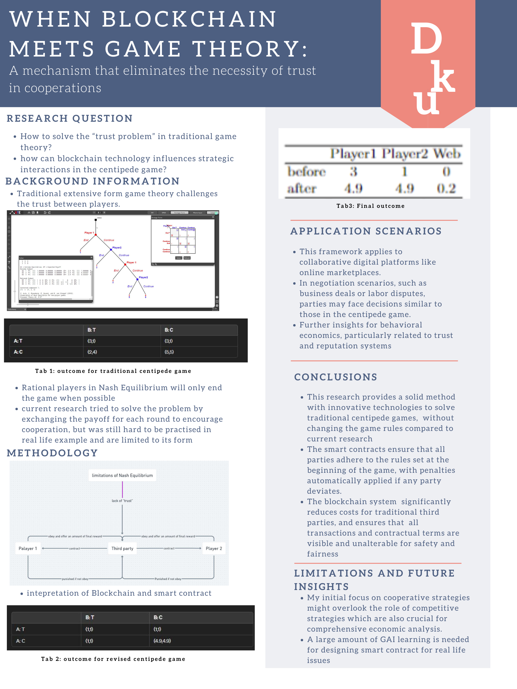

###Shared view of overleaf: https://www.overleaf.com/read/mbqjhbvrtcxm#a03e31

### Summarize the Background/Motivation:
**Gaps in Existing Literature vs. Digital Economy Needs:**
- The primary gap identified in the existing game theory literature is its assumption of perfect information and rational behavior, which doesn't fully address the complexities and strategic interactions in systems involving both humans and AI agents, particularly in the digital economy. The existing frameworks often fail to handle issues related to trust and cooperative behavior adequately, especially when participants do not have complete information or when incentives are misaligned.

### Research Questions:
1. **What are the questions that your research intends to answer?**
   - How can blockchain technology be integrated into game theory to solve trust issues in cooperative games?
   - How does the introduction of smart contracts influence strategic decision-making and outcome distribution in games modeled like the Centipede Game?

2. **Why are the questions important?**
   - These questions are crucial as they address the fundamental problem of trust in economic and strategic interactions, which is a significant hurdle in realizing the full potential of digital and decentralized platforms.

3. **Why are the questions not answered by existing game theory literature?**
   - Existing literature typically does not incorporate technologies like blockchain that can enforce contracts and ensure compliance automatically. Traditional game theory also often overlooks the practical aspects of bounded rationality and incomplete information in its models.

### Application Scenario:
1. **In which real-world situation does your newly proposed game and/or solution concept or mechanism apply?**
   - The proposed game and solution concept can be applied in digital marketplaces, collaborative platforms, and negotiation scenarios such as labor and business disputes where trust is a critical factor.

2. **What is the literature in other disciplines such as psychology that could provide a behavioral foundation for your newly proposed game and/or solution concept, or mechanism?**
   - Behavioral economics and psychology provide insights into human behavior under uncertainty and incomplete information, offering a foundation for understanding how incentives and penalties (like those enforced by smart contracts) influence behavior.

### Methodology:
1. **What is the key game theoretical or mechanism design framework that you build upon?**
   - The key framework is the Nash Equilibrium in extensive form games, especially tailored with the inclusion of smart contracts to ensure compliance and cooperation.

2. **What are the key computational or analytical tools that you apply to answer your research question?**
   - Tools such as Nashpy and QuantEcon are used for computing Nash Equilibria and analyzing the strategic dynamics introduced by blockchain-enforced contracts.

3. **What is the advanced technology or interdisciplinary insights that you integrate into the existing methods that smartly solve your research question?**
   - Integration of blockchain technology for enforcing contracts and AI for predicting outcomes and optimizing strategies, melding insights from computational economics, behavioral science, and technology.

### Preliminary Results:
1. **Can you provide a concrete illustration example of game theory or mechanism design that your approach significantly improves at least one objective of human welfare compared to existing research without your approach?**
   - The implementation of blockchain in the Centipede Game via smart contracts ensures that all participants are better off by adhering to cooperative behavior, which enhances social welfare by preventing early defections that result in suboptimal payoffs.

### Intellectual Merits and Practical impacts of your project:
1. **Can you demonstrate the limitation of your current research that would inspire future research?**
   - The current research primarily focuses on cooperative strategies and might overlook competitive strategies which are also crucial for comprehensive economic analysis. This could lead to further exploration of hybrid models that balance competition and cooperation.

2. **Can you elaborate on how your research can be applied to improve individual, company, and government decisions in strategic scenarios or social choice issues?**
   - By ensuring reliable and transparent contract enforcement without the need for traditional third-party mediation, blockchain can reduce transaction costs and enhance trust, leading to better strategic decisions and more efficient resolution of social choice problems. This can improve negotiations, supply chain management, and compliance in various sectors.
