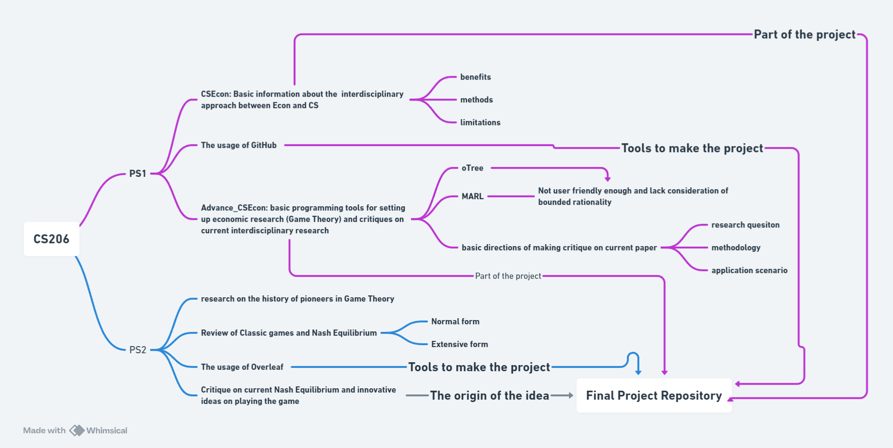

# Jiaqi-Yao_Final-Project

## How to Choose a Good Title? 
Explore effective titling strategies in our [guide](https://www.nature.com/articles/s41562-021-01152-2).

## Project Information
- **Author**: Jiaqi Yao, Majoring in Economics, Class of 2025, Duke Kunshan University
- **Instructor**: Professor Luyao Zhang, Duke Kunshan University
- **Disclaimer**: This is a submission for the Final Project in [COMSCI/ECON 206 Computational Microeconomics](https://ms.pubpub.org/), Spring 2024 Term (Seven Week - Fourth), taught by Professor Luyao Zhang at Duke Kunshan University.
- **Acknowledgements**: I would like to express my deepest gratitude to Professor Luyao Zhang, the esteemed instructor of CS206, for her invaluable guidance and expert knowledge which immensely enriched my learning experience. This academic endeavor would not have been possible without her thoughtful insights and persistent encouragement. 

I am also immensely grateful to my classmates for their thoughtful discussions and the collaborative spirit they maintained throughout the course, providing both academic support and intellectual growth. 

Additionally, I extend my sincere thanks to my parents and friends, whose unwavering support and encouragement have been my constant source of motivation. Their belief in my capabilities has been a tremendous force throughout my studies.

### Introduction to the GitHub Repository

*Figure 1: Mind map of the Final repository*

This repository includes three parts, regarding some thoughts and ideas I generated through each week’s learning content and a final research proposal that combined the phrases and technology I learned in this course with my innovative idea on exploring the new outcome and solutions of traditional games theory, as well as how it can be applied to current society. 
Under the proposal folder, the Latex folder includes the downloaded zip file of my work on Overleaf (a collaborative LaTeX editor for writing scientific documents.) The Colab folder includes my designed coding for realizing the game solution I proposed, with certain outcomes.

As shown in Figure 1, the CSEcon folder shows my discussions during the first week. including considering how can economics be combined with computer science, how this interdisciplinary approach can benefit in the future, and what aspects of this approach should we take into consideration. The discussion starts with an introduction and thoughts on Nobel and Turin winners and ends with future steps that can be taken to achieve those goals.

The Advance_CSEcon folder covers my discussions during the second week, including personal experience with two generative tools on designing and playing the game theory, including the limitations I found about the tools and my proposed solutions. In addition, there were also some summaries, critiques, and thoughts on a paper that we learned during a guest lecture at DKU, and how those problems reminded us of some unsolved questions and restrictions in this interdisciplinary approach. (see figure 1)

Besides the PS1 part shown in the repository, we also had another assignment, PS2, which also contributed a lot to this final project. As shown in Figure 1, the usage of Overleaf and our original idea for this proposal was taught and generated through the process of completing PS2. The whole learning content of this course is continuous and all parts help me better prepare for this final assignment.

Please provide an introduction to the content of this GitHub repository, bearing in mind that external viewers may not be familiar with the terms PS1, PS2, and the Final Project as used in our class. It is essential to include enough background information to bring outsiders up to speed. Additionally, include a flowchart that clearly outlines the logical progression and the interconnections between these assignments for a clearer understanding of the course structure.

## Table of Contents
- [CSEcon](https://github.com/Rising-Stars-by-Sunshine/Jiaqi-yao_Final-Project/tree/main/CSEcon)
- [Advance_CSEcon](https://github.com/Rising-Stars-by-Sunshine/Jiaqi-yao_Final-Project/tree/main/Advance_CSEcon)

## More About the Author

- **Self-Introduction**: 

Hi, I'm Jiaqi Yao, a Junior from Shanghai, who majored in Economics at DKU. I am currently interested in the interaction between GAI, large language models, and economics theories. I am aiming to accumulate more computer science skills to make interdisciplinary approaches in the field of economics that keep pace with the developing technological society.

-**Interests**

- **[Microeconomics]:** I am curious about the more individual-related perspectives of the economic world, focusing on the more behavioral parts such as how individual pursues rationality and how the market reaches equilibrium.
- **[GAI]:** I have a strong interest on how people train machines and come up with machine learning mechanisms. Personally, I believe those are significant tools to reach empirical researches with advanced technology and larger datasets.
- **[Game theory]:** Current game theories are limited to bounded rationality and imperfect information problems that occur in reality, and better interactions with AI may be a solution to this phenomenon.

-**Contact Me**

- **Email:** jy336@duke.edu

-**Final Reflections**: 
  - **Intellectual Growth**: Throughout this course, I have learned to use several new tools such as Otree and Colab with MARL, applying them to explore and develop concepts in game theory. Traditionally, economic and social research required a significant amount of time and effort to conduct both quantitative and qualitative analyses of individual behaviors. The categorization and regulation tasks were manually executed, which often resulted in more time spent and less accuracy achieved. Now, with the aid of machine learning, we are able to handle larger datasets, achieve higher accuracy in generating agent behaviors, and even simulate these behaviors.
For me, the magic of interdisciplinary research lies in our ability to utilize key elements from different fields as efficient tools to address the questions we face. The intersection of two disciplines not only provides innovative ways to solve problems but also introduces additional thoughts and elements that can be considered when addressing traditional questions within a single discipline.

  - **Professional Growth**: Through CS206, I gained a robust set of skills by merging computer science with economics, equipping me with the ability to address complex economic problems using computational techniques such as oTree, MARL and some python packages for designing game theory. By formalizing and simulating microeconomic problems, I learned not only to apply theoretical models but also to create algorithms that can predict and influence outcomes in economic systems. This dual expertise is highly valuable in sectors like finance, data analytics, and public policy, where decision-making processes are increasingly driven by complex data and algorithms. The content also addressed my interest in the area of Game Theory and Blockchain, which better helped me figure out my ambition for my signature work and future research direction.The hands-on approach with problem sets and coding assignments provided practical experience, enhancing my professional profile and preparing me for advanced roles.

  - **Living a Purposeful Life**: In envisioning my future contributions, I am inspired to become the founder of innovative economic mechanisms that leverage technology to promote equitable resource distribution. Winning an Economics Nobel Prize would affirm the impact of my work. My feature sentence might read: "Awarded for pioneering sustainable economic mechanisms that utilize advanced computational models to ensure fairer resource distribution." My goal is to create models that not only drive economic efficiency but also address critical future challenges like the emerging technology of blockchain platforms and metaverse, and how to create a fairer market for such new systems from a multi-objective perspective. Through this work, I aim to fulfill my personal ambitions and contribute meaningfully to societal well-being, blending economic theory with technology to tackle some of the most pressing issues of our times.
